<h1>👋 Hi there im Martijn</h1>

  

 

I'm a Software Developer with a strong passion for Computer Science, Security, Automation, and Game Development.

I enjoy building systems that are not just functional, but technically interesting. I like understanding how things work under the hood — and then pushing them further.

🚀 About Me

🎓 Student IT  
🔐 Interested in Information Security & Networking  
🎮 Making games  
🤖 Bot & automation developing  
🌐 Experienced with APIs, web scraping & data analysis  
🧠 I enjoy designing systems with structure and scalability  

I love:

- Investigating how systems work internally  
- Building tools  
- Breaking systems (ethically 😉)  
- Creating automation that saves time and reduces manual work  
